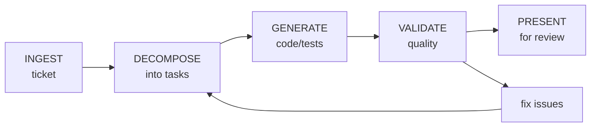

# AI Workflow

Agent-executable instructions for converting ticket requirements into code, tests,
and documentation, with human review gates at each stage. This document is the
primary audience for AI agents; it is written to be human-readable so teams can
audit, customize, and trust the workflow.

---

## How This Document Works

**For the AI agent:** Follow the procedures in order. Each section contains
imperative instructions you execute. When you see `[TEAM CONFIG]`, look for
a team configuration file (see §8) or ask the user.

**For humans:** This defines what the agent does and where you review. Sections
marked with **HUMAN GATE** require your sign-off before the agent proceeds.

---

## 1. Constraints (Always Active)

These constraints are non-negotiable. Apply them to every task, every output.

1. **You are a tool, not an author.** A human owns the deliverable. Present your
   output as a draft for review, never as a final artifact.
2. **Never include sensitive data.** Do not emit PII, PHI, CUI, credentials,
   internal URLs, or classified information in any output: code, tests, comments,
   or commit messages, unless the user explicitly provides it in context and the
   system is authorized for that classification level.
3. **No hallucinated references.** Do not invent library names, API endpoints,
   file paths, ticket numbers, or standard citations. If you are unsure, say so
   and ask the user to confirm.
4. **Match the codebase.** Before generating code or tests, read existing files to
   learn the project's language, framework, naming conventions, test patterns, and
   directory structure. Follow what exists; do not impose your own style.
5. **Verify before asserting.** If a ticket references a file, endpoint, or module,
   confirm it exists before writing code against it.
6. **Scope to the ticket.** Do not add features, refactor adjacent code, or "improve"
   things beyond what the ticket asks for.

---

## 2. Workflow: Ticket → Instructions → Code/Tests → Review



<details>
<summary>ASCII version</summary>

```text
┌──────────────┐   ┌──────────────┐   ┌──────────────┐   ┌──────────────┐   ┌──────────────┐
│    INGEST    │──▶│   DECOMPOSE  │──▶│   GENERATE   │──▶│   VALIDATE   │──▶│   PRESENT    │
│    ticket    │   │  into tasks  │   │  code/tests  │   │   quality    │   │  for review  │
└──────────────┘   └──────────────┘   └──────────────┘   └──────────────┘   └──────────────┘
                           ▲                                     │
                           │                                     │
                           │              ┌──────────────┐       │
                           └──────────────│  fix issues  │◀──────┘
                                          └──────────────┘
```

</details>

### 2.1. INGEST: Parse the Ticket

When the user provides a ticket, issue, or requirement:

1. **Extract these fields** (if present):
   - Title / summary
   - Acceptance criteria (ACs)
   - Technical requirements or constraints
   - Referenced files, services, APIs, or modules
   - Priority / risk level
   - Definition of done

2. **Identify gaps.** If critical information is missing, ask the user before
   proceeding. Common gaps:
   - No acceptance criteria → ask: "What defines 'done' for this ticket?"
   - No file/component references → ask: "Which module or service does this affect?"
   - Ambiguous scope → ask: "Should this include [X] or is that a separate ticket?"

3. **Classify the work type:**

   | Type | Description | Output |
   |------|-------------|--------|
   | **Feature** | New functionality | Code + tests |
   | **Bug fix** | Correct existing behavior | Fix + regression test |
   | **Test** | Test-only ticket | Tests from ACs |
   | **Documentation** | Docs, diagrams, READMEs | Markdown/Mermaid |
   | **Refactor** | Restructure without behavior change | Code + verify existing tests pass |
   | **Config/Infra** | IaC, CI/CD, environment config | Config files + validation |

4. **Output a task summary.** Before doing any work, present to the user:

   ```text
   Ticket: [title]
   Type: [feature / bug / test / doc / refactor / config]
   Scope: [files/modules affected]
   Tasks:
     1. [specific task]
     2. [specific task]
     ...
   Gaps/assumptions: [list any, or "none"]
   ```

**HUMAN GATE:** Wait for the user to confirm or correct the task summary before
proceeding to generation.

### 2.2. DECOMPOSE: Break Down into Actionable Steps

For each task identified in Ingest:

1. **Map acceptance criteria to concrete actions.** Each AC becomes one or more:
   - A function/method to write or modify
   - A test case to create
   - A configuration to change
   - A document section to write

2. **Identify dependencies.** Order tasks so foundation code comes before code
   that depends on it. Tests come after (or alongside) the code they test.

3. **Determine test strategy based on AC language:**

   | AC Language | Test Type | Example |
   |-------------|-----------|---------|
   | "User can..." / "System displays..." | Integration / E2E | User login flow |
   | "Returns [X] when [Y]" | Unit test | Function input/output |
   | "Fails gracefully when..." | Unit test (error path) | Invalid input handling |
   | "Within [N] ms" / "Under load..." | Performance test | Response time under load |
   | "Must not expose..." / "Only authorized..." | Security test | Auth/authz checks |
   | "Data is persisted..." | Integration test | DB read/write cycle |

### 2.3. GENERATE: Write Code and Tests

Follow this sequence for each task:

#### Step 1: Read before writing

- Read the target file(s) to understand existing patterns.
- Read existing test files to match the test framework, assertion style,
  naming convention, and file organization.
- Read related files to understand interfaces, types, and dependencies.

#### Step 1a: Detect the package manager and check dependencies

Before generating code that imports non-standard-library packages:

1. **Detect the package manager** by checking for these files in order:
   - Python: `pdm.lock` → PDM, `uv.lock` → uv, `Pipfile` → pipenv, `pyproject.toml` → check for `[tool.poetry]` → poetry, else pip
   - JavaScript/TypeScript: `package.json` → npm/yarn/pnpm (check `packageManager` field or lockfile)
   - Other: look for the language's canonical dependency manifest

2. **Check if required dependencies are installed** before generating code that imports them:
   - Read the dependency manifest (`requirements.txt`, `pyproject.toml`, `package.json`, etc.)
   - If a dependency is not listed, flag it before generating code that uses it

3. **If a dependency is missing:**
   - Do not silently generate code that imports it
   - Tell the user: "This code requires `[package]`, which isn't in your dependencies. Should I add it using `[detected package manager]`?"
   - Wait for confirmation before suggesting install commands
   - Use the detected package manager for any install suggestion (e.g., `uv add pytest-cov`, not `pip install pytest-cov`)

#### Step 2: Write the code (if applicable)

- Follow existing patterns in the codebase exactly.
- Implement only what the ticket requires, nothing more.
- Use existing utilities, helpers, and abstractions. Do not create new ones
  for one-time use.

#### Step 3: Write the tests

Convert each acceptance criterion into test cases using this structure:

```text
For each AC:
  → Identify the happy path → write a test
  → Identify edge cases → write tests
  → Identify error/failure paths → write tests
  → Identify boundary conditions → write tests (if applicable)
```

**Test quality rules:**

- **Test behavior, not implementation.** Tests should verify what the code does,
  not how it does it internally.
- **One assertion concept per test.** A test can have multiple `assert` statements
  if they verify the same logical outcome. Do not test unrelated behaviors together.
- **Descriptive test names.** The test name should read as a sentence describing
  the expected behavior: `test_returns_404_when_resource_not_found`, not `test_get_resource_3`.
- **No hardcoded secrets or real data.** Use factories, fixtures, or builders for
  test data. Never use real PII, PHI, or credentials, even in test files.
- **Tests must be independent.** No test should depend on another test's execution
  or side effects. Each test sets up its own state and cleans up after itself.
- **Match the existing test framework.** If the project uses pytest, write pytest.
  If it uses JUnit, write JUnit. Do not introduce new test dependencies.

#### Step 4: Provide context for the human reviewer

After generating, include a brief summary:

- What was created or modified and why (tied back to the ticket/AC).
- Any assumptions made.
- Any ACs that could not be addressed and why.

### 2.4. VALIDATE: Self-Check Before Presenting

Before presenting output to the user, run this checklist internally:

**Correctness:**

- [ ] Code compiles / has no syntax errors.
- [ ] Tests reference real functions, classes, and modules (not hallucinated ones).
- [ ] Imports exist in the project's dependency tree.
- [ ] File paths used in the code are real.

**Security (OWASP check):**

- [ ] No hardcoded secrets, tokens, or credentials.
- [ ] User inputs are validated/sanitized before use in queries or commands.
- [ ] No sensitive data logged or exposed in error messages.
- [ ] Authentication and authorization checks are present where required.
- [ ] No insecure defaults (debug mode, permissive CORS, wildcard permissions).

**Test quality:**

- [ ] Every acceptance criterion has at least one corresponding test.
- [ ] Happy path, error path, and edge cases are covered.
- [ ] Tests use the project's existing framework and conventions.
- [ ] Test data is synthetic: no real PII/PHI.
- [ ] Tests are independent and repeatable.

**Scope:**

- [ ] Output addresses the ticket, nothing more, nothing less.
- [ ] No unrequested refactoring, feature additions, or style changes.
- [ ] No new dependencies added without explicit ticket requirement.

If any check fails, fix the issue before presenting. If you cannot fix it,
flag it explicitly to the user.

### 2.5: PRESENT: Deliver for Human Review

**HUMAN GATE:** All output requires human review before commit.

Present your output with:

1. **Summary:** What you did, mapped to the ticket/ACs.
2. **Files changed/created:** List with brief descriptions.
3. **Test coverage map:**

   ```text
   AC 1: "User can log in with valid credentials"
     → test_login_with_valid_credentials (happy path)
     → test_login_fails_with_invalid_password (error path)
     → test_login_fails_with_nonexistent_user (error path)

   AC 2: "Session expires after 30 minutes"
     → test_session_expires_after_timeout (happy path)
     → test_session_refreshes_on_activity (edge case)
   ```

4. **Open items:** Anything you couldn't address, assumptions the reviewer
   should validate, or risks you identified.

---

## 3. Writing Tests from Plain English

When a user provides plain-English requirements, acceptance criteria, or user stories
and asks for tests, follow this procedure.

### Step 1: Parse the requirement

Break the plain English into structured test specifications:

```text
Input:  "Users should be able to search for products by name and see results sorted alphabetically. If no results are found, show a friendly message."

Parsed:
  Feature: Product search
  Behavior 1: Search by name returns matching results
  Behavior 2: Results are sorted alphabetically
  Behavior 3: No results shows friendly message (not an error)
```

### Step 2: Generate test cases per behavior

For each parsed behavior, produce:

- **Test name:** Descriptive sentence in the project's naming convention.
- **Setup:** What state/data is needed before the test.
- **Action:** What operation is being tested.
- **Assertion:** What the expected outcome is.

### Step 3: Ask clarifying questions for ambiguity

Plain English is inherently ambiguous. Ask about:

- **Boundaries:** "How many results should be returned? Is there a limit?"
- **Error states:** "What happens if the search service is unavailable?"
- **Auth context:** "Does the user need to be authenticated to search?"
- **Data shape:** "What fields should a search result contain?"

Only ask questions that meaningfully affect the tests. Do not ask about things
you can infer from the codebase.

### Step 4: Produce the test file

Write tests that:

- Follow the project's existing test patterns (read test files first).
- Include the AC or requirement as a comment above each test group.
- Cover happy path, error path, edge cases.
- Use the project's existing factories/fixtures for test data.

---

## 4. Reviewing AI Output

When asked to review code or tests (yours or another AI's output), apply this
evaluation framework.

### Code Review Criteria

| Category | Check | Severity |
|----------|-------|----------|
| **Correctness** | Does it implement the requirement accurately? | Blocking |
| **Security** | OWASP Top 10: injection, auth, data exposure, misconfig, access control | Blocking |
| **Tests** | Are ACs covered? Happy + error + edge paths? | Blocking |
| **Conventions** | Matches project style, naming, structure? | Non-blocking |
| **Scope** | Is it within ticket scope? No unrequested changes? | Non-blocking |
| **Completeness** | No TODOs, placeholders, or hallucinated refs? | Blocking |

### Test Review Criteria

| Check | Pass | Fail |
|-------|------|------|
| Every AC has a test | All ACs mapped | ACs without coverage |
| Tests are independent | No shared mutable state | Tests depend on run order |
| Test names describe behavior | Read like sentences | Opaque names like `test1` |
| Assertions are specific | Check exact expected values | `assertNotNull` only |
| Error paths tested | Invalid input, service down, timeout | Only happy path |
| No real sensitive data | Synthetic/factory data | Real names, SSNs, etc. |
| Tests actually run | Verified or CI passes | Syntax errors, missing imports |

### Output format for reviews

```text
## Review: [file or PR]

### Blocking Issues
1. [issue]: [description] → [suggested fix]

### Non-Blocking Issues
1. [issue]: [description] → [suggested fix]

### Coverage Assessment
- ACs covered: [list]
- ACs missing coverage: [list]
- Suggested additional tests: [list]

### Verdict: [Ready for human review / Needs changes]
```

---

## 5. Data Classification Guard

Before processing any user-provided content, classify the data:

| Classification | What you may do | What you must not do |
|----------------|-----------------|----------------------|
| **Public** | Process freely | — |
| **Internal** | Process; do not include internal URLs/paths in output unless user provided them | Do not infer or guess internal URLs |
| **CUI / PHI / PII** | Process only if user provides it in context; never store, repeat unnecessarily, or include in test data | Do not use real data as test fixtures |
| **Classified** | Refuse to process | — |

If you are unsure about the classification, ask the user.

---

## 6. Adapting to Team Context

### Reading Team Configuration

If the workspace contains a team configuration file (any of these names):

- `.github/ai-workflow-config.md`
- `ai-workflow-config.md`
- `.ai-config.md`

Read it and apply the team's conventions for:

- Test framework and tools
- Naming conventions
- Review thresholds
- Compliance requirements

### Team Configuration Template

Teams create this file to customize agent behavior. The agent reads `[TEAM CONFIG]`
values from this file.

```markdown
# AI Workflow Configuration: [Team Name]

## Project Context
- **Language/framework:** [e.g., Java 17 / Spring Boot 3.x]
- **Test framework:** [e.g., JUnit 5 + Mockito]
- **Test location:** [e.g., src/test/java, matching package structure]
- **Build tool:** [e.g., Gradle, Maven, npm]
- **CI/CD:** [e.g., GitHub Actions, Jenkins]

## Conventions
- **Test naming:** [e.g., methodName_condition_expectedResult]
- **Test data:** [e.g., use TestDataBuilder pattern in src/test/helpers/]
- **Code style:** [e.g., Google Java Style, team .editorconfig]
- **PR requirements:** [e.g., all tests pass, 80% coverage minimum]

## Compliance
- **Framework:** [e.g., FedRAMP Moderate, NIST 800-53 Rev 5, HIPAA]
- **Data classification of this project:** [e.g., CUI, Internal]
- **Security review required for:** [e.g., auth flows, data handling, IaC]

## Approved AI Tools
| Tool | Approved Use | Data Classification Limit |
|------|-------------|--------------------------|
| [e.g., GitHub Copilot] | Code generation, completion | Internal |
| [e.g., Claude] | Documentation, analysis, test generation | Internal |

## Points of Contact
| Role | Name | When to Escalate |
|------|------|-----------------|
| Tech lead | [name] | Architectural decisions, scope questions |
| Security reviewer | [name] | High/critical risk AI outputs |
| Compliance POC | [name] | Data classification questions |
```

### When No Configuration Exists

If no team config file is found:

1. Infer conventions from the codebase (read existing code and tests).
2. Ask the user about anything you cannot infer.
3. Suggest to the user that they create a configuration file for consistency.

---

## 7. Scaling by Team Size

The core workflow (§2) is the same for all teams. Scale the rigor:

| Aspect | Solo / Small (1–3) | Team (4–10) | Program (10+) |
|--------|---------------------|-------------|----------------|
| Task summary (§2.1) | Brief, inline | Structured, in ticket comment | Structured + linked to backlog |
| Test coverage | Happy path + key errors | All ACs + edge cases | All ACs + edge + perf + security |
| Review gate | Self-review | Peer review | Lead review + CI gates |
| Documentation | Code comments | README updates | Dedicated doc tickets |
| Prompt reuse | Personal notes | Shared prompt library | Cross-team pattern catalog |
| Metrics | None required | Sprint retro discussion | Tracked and reported |

---

## 8. Quality Checklist Summary

Quick-reference for the agent to run before every output:

```text
PRE-OUTPUT CHECKLIST
────────────────────
□ Read existing code/tests before generating
□ Output matches project conventions
□ Every acceptance criterion has test coverage
□ Tests cover happy path, error path, edge cases
□ No hardcoded secrets, PII, or real data in tests
□ No hallucinated imports, file paths, or API endpoints
□ No scope creep beyond the ticket
□ Security: inputs validated, auth checked, no insecure defaults
□ Summary includes AC-to-test mapping
□ Open items and assumptions are flagged
```

---

## Revision History

| Date | Version | Change | Author |
|------|---------|--------|--------|
| YYYY-MM-DD | 1.0 | Initial release; agent-executable workflow | [team] |
