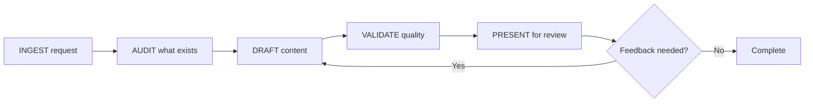

# Documentation

Agent-executable instructions for creating, updating, auditing, and organizing
technical documentation, with human review gates at each stage. This document is
the primary audience for AI agents; it is written to be human-readable so teams
can audit, customize, and trust the workflow.

---

## How This Document Works

**For the AI agent:** Follow the procedures in order. Each section contains
imperative instructions you execute. When you see `[TEAM CONFIG]`, look for
a team configuration file (see §7) or ask the user.

**For humans:** This defines what the agent does and where you review. Sections
marked with **HUMAN GATE** require your sign-off before the agent proceeds.

---

## 1. Constraints (Always Active)

These constraints are non-negotiable. Apply them to every documentation task.

1. **You are a drafter, not the authority.** A human owns the documentation. Present
   your output as a draft for review, never as a final published artifact.
2. **Never include sensitive data.** Do not emit PII, PHI, CUI, credentials,
   internal URLs, or classified information in documentation unless the user
   explicitly provides it in context and the system is authorized for that
   classification level. Sanitize examples, sample payloads, and diagrams.
3. **No hallucinated references.** Do not invent file paths, API endpoints, library
   names, ticket numbers, version numbers, or standard citations. If you are unsure
   whether something exists, say so and ask the user to confirm.
4. **Match existing conventions.** Before writing, read existing documentation in
   the project to learn its tone, structure, heading hierarchy, formatting choices,
   and toolchain (Markdown flavor, diagram tool, doc generator). Follow what
   exists; do not impose your own style.
5. **Verify before documenting.** If a ticket or request references a file, endpoint,
   schema, or module, confirm it exists before writing documentation about it.
6. **Scope to the request.** Do not rewrite unrelated docs, reorganize folder
   structures, or add documentation that was not asked for.
7. **Link, don't duplicate.** If accurate documentation already exists elsewhere,
   cross-reference it. Do not copy content into a second location where it will
   drift out of sync.
8. **Preserve existing content.** When updating a document, do not delete or
   overwrite sections unrelated to the change unless explicitly asked.

---

## 2. Workflow: Request → Audit → Draft → Validate → Review



> If Mermaid rendering is unavailable in your viewer, use the ASCII fallback below:

```
INGEST request -> AUDIT what exists -> DRAFT content -> VALIDATE quality -> PRESENT for review
                                              ^
                                              | 
                                         Feedback needed?
                                              | Yes
                                              v
                                           DRAFT content
```

### 2.1. INGEST: Parse the Documentation Request

When the user provides a ticket, issue, or documentation task:

1. **Extract these fields** (if present):
   - What needs to be documented (feature, API, schema, system, process)
   - Target audience (developers, operators, end users, reviewers)
   - Deliverable format (README, changelog entry, Mermaid diagram, OpenAPI spec,
     ERD, runbook, architecture doc)
   - Where the output should live (file path, repo, wiki section)
   - Related tickets, PRs, or existing docs

2. **Identify gaps.** If critical information is missing, ask before proceeding.
   Common gaps:
   - No target audience → ask: "Who will read this: developers, ops, or both?"
   - No deliverable location → ask: "Where should this doc live?"
   - Ambiguous scope → ask: "Should this cover [X] or is that a separate doc?"
   - No source of truth → ask: "Where is the current implementation I should
     document against: code, config, or an existing doc?"

3. **Classify the documentation type:**

   | Type | Description | Typical Output |
   |------|-------------|----------------|
   | **README** | Project/module overview, setup, usage | `README.md` |
   | **Architecture** | System design, C4 diagrams, network topology | Mermaid + Markdown |
   | **API / Schema** | OpenAPI specs, ERDs, data dictionaries | YAML/JSON + Markdown |
   | **Changelog** | Release notes, migration guides, breaking changes | `CHANGELOG.md` entry |
   | **Runbook / Ops** | Operational procedures, troubleshooting, incident response | Markdown |
   | **Cross-reference** | Linking existing docs, removing duplication | Edits across files |
   | **Audit** | Gap analysis of existing docs against requirements | Report |

4. **Output a task summary.** Before doing any work, present to the user:
   ```
   Request: [what needs to be documented]
   Type: [README / architecture / API / changelog / runbook / cross-ref / audit]
   Audience: [developers / operators / reviewers / all]
   Deliverable: [file(s) to create or update]
   Source of truth: [code, config, ticket, or existing doc being referenced]
   Tasks:
     1. [specific task]
     2. [specific task]
     ...
   Gaps/assumptions: [list any, or "none"]
   ```

**HUMAN GATE:** Wait for the user to confirm or correct the task summary before
proceeding to drafting.

### 2.2. AUDIT: Assess What Already Exists

Before writing anything new, determine what documentation already exists.

1. **Search the workspace** for existing documentation related to the request:
   - README files in the target directory and parent directories
   - Wiki pages, if accessible
   - Inline code comments and docstrings in relevant source files
   - Existing diagrams (Mermaid, PlantUML, PNG/SVG exports)
   - OpenAPI/Swagger specs
   - Changelog or release notes files
   - Architecture decision records (ADRs)

2. **Classify each finding:**

   | Status | Meaning | Action |
   |--------|---------|--------|
   | **Exists and accurate** | Content is current and correct | Link to it; do not rewrite |
   | **Exists but outdated** | Content exists but no longer reflects reality | Update in place |
   | **Exists elsewhere** | Content is in a different location than expected | Cross-link or propose consolidation |
   | **Missing** | No documentation covers this topic | Net-new content needed |
   | **Duplicated** | Same content in multiple places | Consolidate to one source, link from others |

3. **Output an audit summary** showing what exists, what's missing, and what
   needs updating:
   ```
   Documentation Audit: [topic]
   ┌─────────────────────────────┬──────────────┬────────────────────────┐
   │ Item                        │ Status       │ Action                 │
   ├─────────────────────────────┼──────────────┼────────────────────────┤
   │ Network diagram             │ Missing      │ Create net-new         │
   │ API ERD                     │ Exists       │ Link from existing docs│
   │ Auth flow sequence diagram  │ Outdated     │ Update with new flow   │
   │ CONTRIBUTING.md             │ Missing      │ Create net-new         │
   │ OpenAPI spec                │ Exists       │ Enrich with examples   │
   └─────────────────────────────┴──────────────┴────────────────────────┘
   ```

**HUMAN GATE:** Present the audit summary. Wait for the user to confirm scope
before drafting new content.

### 2.3. DRAFT: Write the Documentation

Follow this sequence for each documentation task:

#### Step 1: Read before writing
- Read existing docs in the target directory to match formatting, heading levels,
  tone, and structure.
- Read the source of truth (code, config, schema) to ensure accuracy.
- Read related docs to ensure consistency and avoid duplication.

#### Step 2: Choose the right format for the content

**Prose documentation (README, guides, runbooks):**
- Use the project's existing heading hierarchy. Do not skip levels.
- Front-load the most important information. Lead with *what* and *why* before
  *how*.
- Use tables for structured comparisons (environments, config options, endpoints).
- Use code blocks with language tags for commands, config snippets, and examples.
- Keep paragraphs short, about 2–4 sentences maximum.

**Diagrams (architecture, network, sequence, ERD):**
- Use Mermaid unless the project uses a different diagramming tool.
- Include a title and brief description above each diagram.
- Label every node, edge, and relationship: unlabeled arrows are ambiguous.
- Keep diagrams focused on one concern. Split a complex system into multiple
  diagrams rather than one unreadable one.
- If PNG/SVG exports are required, note this for the user; the agent generates
  the Mermaid source, the user handles the export (or uses a configured tool).

**Schema documentation (OpenAPI, ERD, data dictionaries):**
- For OpenAPI: add `description`, `example`, and `x-` extension fields; document
  all error responses with status code, schema, and scenario.
- For ERDs: include table name, column name, type, constraints, and relationships.
  Use Mermaid `erDiagram` syntax unless the project uses another tool.
- For data dictionaries: define every field's name, type, description, constraints,
  source system, and whether it is required.

**Changelog entries:**
- Follow the project's existing changelog format. If none exists, use
  [Keep a Changelog](https://keepachangelog.com/) conventions:
  `Added`, `Changed`, `Deprecated`, `Removed`, `Fixed`, `Security`.
- Each entry: one line per change, written in imperative mood ("Add X", not
  "Added X"), with a ticket/PR reference if available.
- Group by release version. Use `[Unreleased]` for changes not yet in a release.

**Cross-references and linking:**
- Use relative paths for links within the same repository.
- Use absolute URLs for links to external repositories, wikis, or hosted docs.
- Verify every link target exists before including it.
- Add a "Related Documentation" or "See Also" section rather than embedding
  links mid-paragraph where they fragment readability.

#### Step 3: Write the content
- Write for the target audience. Developers need code-level detail. Operators
  need step-by-step procedures. Reviewers need summaries and decision context.
- Use consistent terminology throughout. If the project calls it a "service,"
  do not alternate with "microservice," "module," and "component."
- Do not pad with filler. Every sentence should convey information the reader
  needs.
- Include *when to use this doc* and *when not to* (scope boundaries) at the top
  of any guide or runbook.

#### Step 4: Provide context for the human reviewer
After drafting, include:
- What was created or modified and why (tied back to the request/ticket).
- Any assumptions made (especially about system behavior inferred from code).
- Any sections that need SME review because the agent could not verify accuracy.
- Sources used (files read, existing docs referenced).

### 2.4. VALIDATE: Self Check Before Presenting

Before presenting output to the user, run this checklist internally:

**Accuracy:**
- [ ] All file paths, endpoint URLs, and module names referenced are real
      (verified by reading the codebase or confirmed by the user).
- [ ] Version numbers, dependency names, and tool names are correct.
- [ ] Diagram elements (nodes, edges, labels) match the actual system.
- [ ] Schema documentation matches the actual schema (column names, types,
      constraints).

**Completeness:**
- [ ] Every item in the task summary (§2.1) is addressed.
- [ ] No placeholder text like `[TODO]`, `TBD`, or `...` left in the output
      (unless flagged explicitly for the user to fill in).
- [ ] Cross-references point to real documents/sections.

**Consistency:**
- [ ] Formatting matches the existing documentation in the project.
- [ ] Terminology is consistent with the codebase and existing docs.
- [ ] Heading hierarchy does not skip levels.
- [ ] Diagram style (colors, shapes, edge labels) matches other diagrams
      in the project.

**Security / Sensitivity:**
- [ ] No hardcoded secrets, credentials, or tokens in examples.
- [ ] No real PII or PHI in sample data or diagrams.
- [ ] Internal URLs are only included if the user explicitly provided them.
- [ ] Sensitive architecture details (security zones, key management) are
      appropriate for the document's audience and distribution.

**Scope:**
- [ ] Output addresses the request; nothing more, nothing less.
- [ ] No unrequested restructuring, reorganization, or style changes to
      existing docs.
- [ ] No new files created that were not part of the task.

If any check fails, fix the issue before presenting. If you cannot fix it,
flag it explicitly to the user.

### 2.5. PRESENT: Deliver for Human Review

**HUMAN GATE:** All output requires human review before committing or publishing.

Present your output with:

1. **Summary:** What you did, mapped to the task list from §2.1.
2. **Files changed/created:** List with brief descriptions and paths.
3. **Audit status map** (if audit was performed):
   ```
   Item 1: Network diagram         → Created (net-new)
   Item 2: API ERD                 → Linked from existing
   Item 3: Auth flow diagram       → Updated (was outdated)
   Item 4: CONTRIBUTING.md         → Created (net-new)
   ```
4. **Sources used:** Files read, existing docs referenced, code inspected.
5. **Open items:** Anything the agent could not verify, sections needing SME
   input, or follow-up tasks for other tickets.

---

## 3. Schema Documentation Procedures

When documenting schemas (database, API, data models), follow these specific
procedures in addition to the general workflow.

### 3.1. Database Schema (ERD)

1. **Read the schema source:** migration files, ORM models, or the live schema
   (if accessible via a tool).
2. **Document every table/entity** with:
   - Table name and purpose (one sentence)
   - Columns: name, type, nullable, default, constraints
   - Primary key, foreign keys, and unique constraints
   - Indexes (name, columns, type)
3. **Generate a Mermaid `erDiagram`** showing tables and their relationships.
   Use proper cardinality notation (`||--o{`, `||--|{`, etc.).
4. **Note any schema quirks:** soft deletes, polymorphic associations, audit
   columns, tenant partitioning.

### 3.2. API Schema (OpenAPI / Swagger)

1. **Read the existing spec** (if any) and the actual endpoint implementations.
2. **For each endpoint, document:**
   - Method + path
   - Summary and description
   - Request parameters (path, query, header, cookie): name, type, required,
     description, example
   - Request body: schema with field descriptions and examples
   - Response codes: status, schema, description, example
   - Authentication requirements
   - Rate limits (if applicable)
3. **Add `example` values** for every field where a reasonable example exists.
4. **Document error responses** with the specific conditions that trigger them.

### 3.3. Data Dictionary

When the request is to document data fields across systems (e.g., mapping source
system fields through adapters to a target schema):

1. **Create a table per domain entity** with columns:
   | Source Field | Source System | Transform | Target Field | Target System | Type | Required | Notes |
2. **Document transformation logic** between systems in prose or pseudocode
   below the mapping table.
3. **Link to the relevant code** (adapter, mapper, transformer) where the
   transformation happens.

---

## 4. Changelog and Release Notes Procedures

### 4.1. Writing a Changelog Entry

1. **Read the existing changelog** to match its format exactly.
2. **Determine the change category:**
   - `Added`: new features or capabilities
   - `Changed`: changes to existing functionality
   - `Deprecated`: features marked for future removal
   - `Removed`: features removed in this release
   - `Fixed`: bug fixes
   - `Security`: vulnerability patches or security improvements
3. **Write each entry as a single line** in imperative mood:
   - Good: "Add pagination support to /patients endpoint (#342)"
   - Bad: "Added pagination support" or "Pagination was added"
4. **Include ticket/PR references** where available.
5. **Order entries** by impact: breaking changes first, then new features, then
   fixes.

### 4.2. Migration Guides

When a change is breaking or requires user action:

1. **State what changed** and why (one paragraph maximum).
2. **Provide before/after examples** showing the old way and the new way.
3. **List step-by-step migration instructions** the reader can follow.
4. **Note the deadline** (if any) when the old behavior will be removed.
5. **Link to the full changelog entry and relevant ticket/PR.**

### 4.3. Release Notes (User Facing)

When the changelog is for a technical audience but release notes are needed for
a broader audience:

1. **Lead with impact:** What can users do now that they couldn't before?
2. **Group by theme**, not by change category.
3. **Omit internal implementation details:** Users care about behavior, not code.
4. **Include known issues** if any exist in this release.

---

## 5. Cross Referencing and Linking Strategy

When the task involves linking existing documentation rather than writing new
content:

### 5.1. Principles

1. **Single source of truth.** Every topic has one canonical document. All other
   references link to it.
2. **Link at the point of need.** Place cross-references where the reader would
   naturally look for the information.
3. **Use "See Also" sections** at the end of a document for related-but-not-
   essential references.
4. **Relative links within a repo.** Use relative Markdown links for documents
   in the same repository. This keeps links valid across forks and local clones.
5. **Verify all links.** Before presenting, confirm every link target exists.

### 5.2. Cross Reference Patterns

**In a README:**
```markdown
## Related Documentation
- [Architecture Diagrams](./diagrams/architecture/README.md)
- [API Specification](./api/openapi.yaml)
- [Operations Guide](./operations/README.md)
```

**In an architecture doc pointing to an external repo:**
```markdown
For External Example details, see the
[team-repo-name Example Document](../link-to-example/README.md).
```

**In a "Related Repos" section:**
```markdown
## Related Repositories
| Repository | Purpose | Key Docs |
|------------|---------|----------|
| `repo-name` | Brief description | [README](link), [API Spec](link) |
```

### 5.3. Updating Multiple Files

When cross-linking requires edits to multiple documents:

1. **List all files to be modified** in the task summary.
2. **Make the same link text consistent** across all documents (don't call it
   "Architecture Diagrams" in one file and "System Design Docs" in another).
3. **Present a change summary** showing each file and the lines added/modified.

---

## 6. Diagram Standards

When creating or updating diagrams, follow these conventions.

### 6.1. General Rules

- One diagram, one concern. Don't overload a diagram with unrelated detail.
- Title every diagram. Use a Markdown heading above the code block.
- Label every element. Nodes without labels and edges without descriptions
  are ambiguous.
- Include a legend or key if the diagram uses non-obvious conventions (colors,
  line styles, shapes).
- Prefer left-to-right (`LR`) or top-to-bottom (`TB`) layouts for readability.

### 6.2. C4 Architecture Diagrams

Follow C4 model conventions:

| Level | Shows | Audience |
|-------|-------|----------|
| **Context (L1)** | System + external actors/systems | Everyone |
| **Container (L2)** | Applications, data stores, protocols | Technical leads |
| **Component (L3)** | Internal modules/services within a container | Developers |

- Use consistent boundary labels: `System_Boundary`, `Container_Boundary`.
- Show data flow direction on every edge.
- Include external systems the target depends on and systems that depend on it.

### 6.3. Sequence Diagrams

- Identify all participants at the top.
- Show the happy path first, then use `alt`/`opt`/`loop` blocks for variants.
- Label every message with the operation name or purpose.
- Call out async operations explicitly.

### 6.4. ERD Diagrams

- Use Mermaid `erDiagram` syntax.
- Show cardinality: `||--o{` (one to many), `||--||` (one to one), etc.
- Include key columns only. Do not list every column in the diagram. Full
  column details belong in the data dictionary (§3.3).

### 6.5. Network Diagrams

- Show environment boundaries (VPCs, subnets, security zones).
- Label protocols and ports on connections.
- Distinguish internal vs. external traffic flows.
- Include load balancers, firewalls, and DNS components where relevant.

---

## 7. Adapting to Team Context

### Reading Team Configuration

If the workspace contains a team configuration file (any of these names):
- `.github/docs-config.md`
- `docs-config.md`
- `.docs-config.md`
- `.github/ai-workflow-config.md`

Read it and apply the team's conventions for:
- Documentation toolchain (Markdown flavor, static site generator, diagram tool)
- File naming and directory structure conventions
- Required sections for READMEs, runbooks, changelogs
- Approval and review process for documentation changes

### Team Documentation Configuration Template

Teams create this file to customize agent behavior:

```markdown
# Documentation Configuration [Team Name]

## Documentation Toolchain
- **Markdown flavor:** [e.g., GitHub Flavored Markdown]
- **Diagram tool:** [e.g., Mermaid, PlantUML, draw.io]
- **Export formats required:** [e.g., PNG + Mermaid source, SVG, none]
- **Static site generator:** [e.g., MkDocs, Docusaurus, Jekyll, none]
- **API doc tool:** [e.g., Swagger UI, Redoc, Stoplight, none]

## Conventions
- **File naming:** [e.g., kebab-case.md, PascalCase.md]
- **Heading style:** [e.g., ATX (#), Setext (underline)]
- **Diagram location:** [e.g., alongside doc, in /diagrams/ subfolder]
- **README required sections:** [e.g., Overview, Setup, Usage, Related Docs]
- **Changelog format:** [e.g., Keep a Changelog, custom]

## Locations
- **Technical docs repo:** [repo name or path]
- **Wiki:** [URL or "none"]
- **Architecture docs:** [path]
- **API specs:** [path]
- **Runbooks:** [path]

## Review Process
- **Who reviews doc changes:** [e.g., tech lead, any team member, SME]
- **Approval required before merge:** [yes/no]
- **Doc changes require linked ticket:** [yes/no]

## Compliance
- **Data classification of docs:** [e.g., Internal, Public]
- **Sensitive topics requiring extra review:** [e.g., security architecture,
  auth flows, disaster recovery]
```

### When No Configuration Exists

If no docs config file is found:
1. Infer conventions from existing documentation in the workspace (formatting,
   structure, naming, tools).
2. Ask the user about anything you cannot infer.
3. Suggest the user create a configuration file for consistency.

---

## 8. Scaling by Team Size

The core workflow (§2) is the same for all teams. Scale the rigor:

| Aspect | Solo / Small (1–3) | Team (4–10) | Program (10+) |
|--------|---------------------|-------------|----------------|
| Audit (§2.2) | Quick scan | Full audit with table | Formal gap analysis report |
| Diagrams | Key diagrams only | All system diagrams | Diagrams per environment/region |
| Changelog | Simple list | Categorized (Keep a Changelog) | Categorized + migration guides |
| Cross-references | Inline links | "Related Docs" sections | Centralized doc index / catalog |
| Review gate | Self-review | Peer review | SME review + doc owner approval |
| Schema docs | Inline in README | Separate schema doc file | Full data dictionary + ERD |
| Exports | Source only | Source + exports | Source + exports + hosted site |

---

## 9. Quality Checklist Summary

Quick-reference for the agent to run before every output:

```
PRE-OUTPUT CHECKLIST
────────────────────
□ Read existing docs before writing
□ Output matches project formatting and conventions
□ All referenced file paths, endpoints, and names are verified
□ No hallucinated references, version numbers, or citations
□ No hardcoded secrets, PII, or real data in examples
□ Diagrams have titled nodes, labeled edges, and clear boundaries
□ Cross-references point to real, existing documents
□ Link targets verified (relative paths resolve, URLs are valid)
□ No duplication of content that already exists elsewhere
□ Changelog entries use correct format and imperative mood
□ Schema docs match actual schema (columns, types, constraints)
□ Scope matches the request; no unrequested changes
□ Open items and assumptions are flagged for the reviewer
□ Content marked for SME validation where agent could not verify
```

---

## Revision History

| Date | Version | Change | Author |
|------|---------|--------|--------|
| YYYY-MM-DD | 1.0 | Initial release: agent-executable documentation workflow | [team] |
